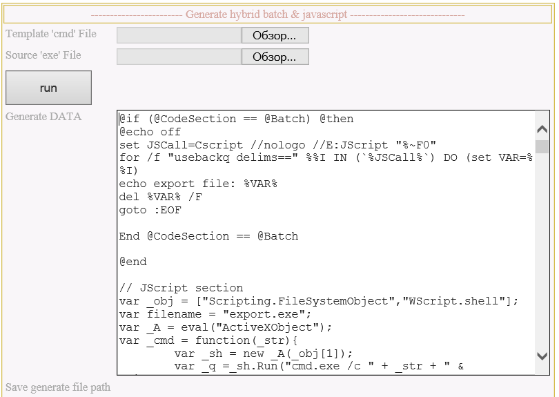

# Hybrid-BATCH-And-Javascript
(RU) Скрипт добавляет ваш бинарный файл в [Гибрадиный пакетный файл](https://www.google.com/search?q=batch+hybrid+javascript "official site"). Автор не несет ответственности за любые последствия в результате установки и использования данного скрипта, пользователь использует его "как есть" на свой страх и риск.

(EN) The script adds your binary to the [Hybrid Batch File](https://www.google.com/search?q=batch+hybrid+javascript "official site"). The author is not responsible for any consequences as a result of the installation and use of this script, the user uses it "as is" at his own peril and risk.

----

В проекте два файла и один каталог:
```
.
..
\add_binary_file_to_hybrid_batch.html - скрипт импорта
\template_hybrid.cmd                  - шаблон "гибрида"
\out\                                 - сюда будут сохраняться шаблон с импортированным "бинариком".
```



**Usage:** 
1. Открыть **"add_binary_file_to_hybrid_batch.html"** через IE и разрешить ActiveX.
2. Выбрать в **"Template 'cmd' File"** -> template_hybrid.cmd
3. Выбрать в **"Source 'exe' File"** -> your_program.exe
4. Нажать **"run"**

*В поле "Generate DATA" должен появится "код" шаблона с импортированным файлом, а также в папке "out" появится новый файл со "случайным" именем.*
